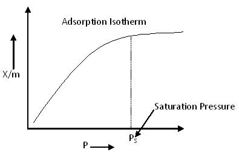
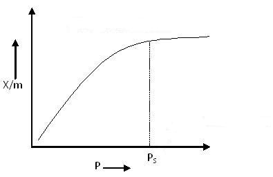
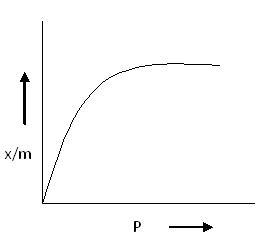
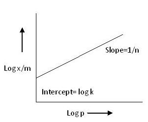
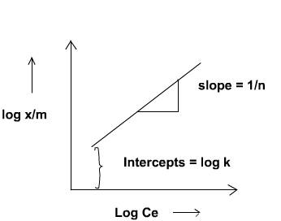
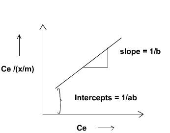

## Theory 

  Adhesion of atoms, ions, biomolecules or molecules of gas, liquid or dissolved solids to a surface is called <strong>adsorption</strong>.
  This process creates a film of the <em>adsorbate</em> – the molecules or atoms being accumulated, on the surface of the <em>adsorbent</em>.

<h3>Examples:</h3>
<ul>
  <li>Activated charcoal adsorbs gases like CO2, SO2, Cl2, etc.</li>
  <li>Pt or Ni metal kept in contact with a gas adsorbs the gas – Hydrogenation of oils.</li>
  <li>Animal charcoal, when added to acetic acid solution and shaken vigorously, adsorbs acetic acid.</li>
  <li>Molasses is decolourised by activated charcoal.</li>
</ul>

  The molecules of gases or liquids or the solutes in solutions adhere to the surface of the solids. 
  In the adsorption process, two substances are involved:

<ul>
  <li>
    <strong>Adsorbent:</strong> The substance on whose surface the adsorption occurs is known as adsorbent.
  </li>
  <li>
    <strong>Adsorbate:</strong> The substance whose molecules get adsorbed on the surface of the adsorbent 
    (i.e. solid or liquid) is known as adsorbate.
  </li>
</ul>

  Adsorption is different from absorption. In <strong>absorption</strong>, the molecules of a substance are 
  uniformly distributed in the bulk of the other, whereas in <strong>adsorption</strong>, molecules of one 
  substance are present in higher concentration on the surface of the other substance.

<h3>Types of Adsorption:</h3>

  Depending upon the nature of forces existing between adsorbate molecules and adsorbent, 
  the adsorption can be classified into two types:

<ol>
  <li>
    <strong>Physical adsorption (physisorption):</strong> 
    If the force of attraction existing between adsorbate and adsorbent are Van der Waals forces, 
    the adsorption is called physical adsorption. It is also known as Van der Waals adsorption. 
    In physical adsorption, the force of attraction between the adsorbate and adsorbent is very weak; 
    therefore, this type of adsorption can be easily reversed by heating or by decreasing the pressure.
  </li>

  <li>
    <strong>Chemical adsorption (chemisorption):</strong> 
    If the force of attraction existing between adsorbate and adsorbent is almost of the same strength 
    as chemical bonds, the adsorption is called chemical adsorption. It is also known as Langmuir adsorption. 
    In chemisorption, the force of attraction is very strong; therefore, adsorption cannot be easily reversed.
  </li>
</ol>

<h3>Comparison between Physisorption and Chemisorption</h3>

<table cellpadding="8" cellspacing="0">
  <thead>
    <tr>
      <th>Physisorption</th>
      <th>Chemisorption</th>
    </tr>
  </thead>
  <tbody>
    <tr>
      <td>1. Low heat of adsorption usually in the range of 20–40 kJ mol–1</td>
      <td>High heat of adsorption in the range of 40–400 kJ mol–1</td>
    </tr>
    <tr>
      <td>2. Force of attraction are Van der Waals forces</td>
      <td>Forces of attraction are chemical bond forces</td>
    </tr>
    <tr>
      <td>3. It usually takes place at low temperature and decreases with increasing temperature</td>
      <td>It takes place at high temperature</td>
    </tr>
    <tr>
      <td>4. It is reversible</td>
      <td>It is irreversible</td>
    </tr>
    <tr>
      <td>5. It is related to the ease of liquefaction of the gas</td>
      <td>The extent of adsorption is generally not related to liquefaction of the gas</td>
    </tr>
    <tr>
      <td>6. It is not very specific</td>
      <td>It is highly specific</td>
    </tr>
    <tr>
      <td>7. It forms multi-molecular layers</td>
      <td>It forms monomolecular layers</td>
    </tr>
    <tr>
      <td>8. It does not require any activation energy</td>
      <td>It requires activation energy</td>
    </tr>
  </tbody>
</table>

<h3>Factors Affecting Adsorption:</h3>

The extent of adsorption depends upon the following factors:

<ul>
  <li><strong>Nature of adsorbate and adsorbent:</strong> The type and properties of both the adsorbate and adsorbent influence the adsorption process.</li>
  <li><strong>Surface area of adsorbent:</strong> Greater surface area provides more sites for adsorption, increasing the extent of adsorption.</li>
  <li><strong>Activation of adsorbent:</strong> Activation increases the adsorbent's surface activity and adsorption capacity.</li>
  <li><strong>Experimental conditions:</strong> Conditions such as temperature, pressure, and concentration significantly affect adsorption behavior.</li>
</ul>

### Adsorption Isotherm:

Adsorption process is usually studied through graphs known as adsorption isotherm. That is the amount of adsorbate on the adsorbent as a function if its pressure or concentration at constant temperature .The quantity adsorbed is nearly always normalized by the mass of the adsorbent to allow comparison of different materials.

<h3>Basic Adsorption Isotherm:</h3>

  From the above, we can predict that after saturation pressure (<em>Ps</em>), adsorption does not occur anymore. 
  This is because there are a limited number of vacancies on the surface of the adsorbent. 
  At high pressure, a stage is reached when all the sites are occupied, and further increase in pressure does not affect the adsorption process. 
  Thus, at high pressure, adsorption becomes independent of pressure.

<h3>Type of Adsorption Isotherm:</h3>

  Five different types of adsorption isotherms and their characteristics are explained below.

### Type I Adsorption Isotherm:

<h3>Type I Adsorption Isotherm</h3>

  The above graph depicts <strong>monolayer adsorption</strong>. This behavior can be explained using the 
  <strong>Langmuir Adsorption Isotherm</strong>.

  According to the BET equation, when <em>P/P0 &lt;&lt; 1</em> and <em>c &gt;&gt; 1</em>, monolayer formation occurs,
  resulting in a Type I Adsorption Isotherm.

  <strong>Examples:</strong> Adsorption of Nitrogen (N2) or Hydrogen (H2) on charcoal 
  at temperatures near −180°C.

### Type II Adsorption Isotherm:

<h3>Type II Adsorption Isotherm</h3>

  Type II Adsorption Isotherm shows a significant deviation from the Langmuir model of adsorption.
  The intermediate flat region in the isotherm corresponds to <strong>monolayer formation</strong>, after which 
  multilayer adsorption begins.

  In the BET equation, this type of isotherm is obtained when the value of <strong>C</strong> is much greater than 1.

  <strong>Examples:</strong>
  <ul>
    <li>Nitrogen (N2(g)) adsorbed at −195°C on Iron (Fe) catalyst</li>
    <li>Nitrogen (N2(g)) adsorbed at −195°C on silica gel</li>
  </ul>

### Type III Adsorption Isotherm:

<h3>Type III Adsorption Isotherm</h3>

  Type III Adsorption Isotherm also shows a large deviation from the Langmuir model of adsorption.
  This isotherm represents <strong>multilayer adsorption</strong> without a distinct monolayer formation stage.

  According to the BET equation, this type of isotherm is obtained when the value of <strong>C &lt;&lt;&lt; 1</strong>.

  Unlike Type I and Type II isotherms, there is <strong>no flat region</strong> in the curve, indicating that monolayer formation does not occur.

  <strong>Examples:</strong>
  <ul>
    <li>Bromine (Br2) adsorbed at 790°C on silica gel</li>
    <li>Iodine (I2) adsorbed at 790°C on silica gel</li>
  </ul>

### Type IV Adsorption Isotherm:

<h3>Type IV Adsorption Isotherm</h3>

  At lower pressures, the graph for Type IV Adsorption Isotherm closely resembles that of Type II, 
  indicating <strong>monolayer formation followed by multilayer adsorption</strong>.

  The intermediate flat region in the isotherm corresponds to the formation of a monolayer. 
  However, the saturation level is reached at a pressure <strong>below the saturation vapor pressure</strong>. 
  This is explained by the condensation of gases in the <strong>tiny capillary pores</strong> of the adsorbent at 
  pressures below the saturation pressure (<em>PS</em>) of the gas.

  <strong>Examples:</strong>
  <ul>
    <li>Adsorption of Benzene on Iron Oxide (Fe2O3) at 500°C</li>
    <li>Adsorption of Benzene on silica gel at 500°C</li>
  </ul>

### Type V Adsorption Isotherm:

<h3>Type V Adsorption Isotherm</h3>

  The explanation of the Type V adsorption isotherm is similar to that of Type IV. 
  It also exhibits <strong>capillary condensation</strong> of gases in micropores.

  Unlike Type III, the Type V isotherm begins with weak adsorbate–adsorbent interactions, but as pressure increases, 
  adsorption accelerates due to condensation in the pores of the adsorbent.

  <strong>Example:</strong>
  <ul>
    <li>Adsorption of water vapor at 1000°C on charcoal</li>
  </ul>

  Both <strong>Type IV</strong> and <strong>Type V</strong> isotherms demonstrate the phenomenon of capillary condensation of gas.

<h3>Freundlich Adsorption Isotherm</h3>

  In 1909, <strong>Freundlich</strong> proposed an empirical equation to represent the isothermal variation of adsorption—i.e., 
  the quantity of gas adsorbed per unit mass of a solid adsorbent with pressure.

  This equation is known as the <strong>Freundlich Adsorption Isotherm</strong>, 
  <strong>Freundlich Adsorption Equation</strong>, or simply the <strong>Freundlich Isotherm</strong>.

$$\frac{x}{m}=kP^{\frac{1}{n}}$$

<h4>Freundlich Adsorption Equation:</h4>

  <em>x/m</em> = adsorption per gram of adsorbent, where:

<ul>
  <li><strong>x</strong> = amount of adsorbate</li>
  <li><strong>m</strong> = mass of adsorbent</li>
</ul>

  <strong>P</strong> is the pressure, and <strong>k</strong> and <strong>n</strong> are constants whose values depend upon the nature of the adsorbent, the adsorbate, and the temperature.

  Though the Freundlich Isotherm correctly establishes the relationship between adsorption and pressure at lower values, 
  it fails to predict adsorption behavior at high pressures. This limitation is due to the empirical nature of the equation.

  As shown in the corresponding diagram (Freundlich Isotherm Curve), the value of <em>x/m</em> increases with increasing pressure <em>P</em>, 
  but the rate of increase slows down because <em>n &gt; 1</em>. Hence, adsorption does not increase sharply with pressure.

  This curve is commonly referred to as the <strong>Freundlich Isotherm Curve</strong>.

Taking the logarithms of a first equation.

$$\frac{\log(x)}{m}=\log k+\frac{1}{n}\log P$$

Hence, if a graph of log x/m is plotted against log p, it will be a straight line in the following diagram.

  From this, the value of <strong>slope</strong> is equal to <em>1/n</em> and the value of <strong>intercept</strong> is equal to <em>log k</em>. 
  Over and above, if the graph of <em>log (x/m)</em> against <em>log P</em> comes out to be a straight line, 
  it can be assured that the Freundlich Adsorption Isotherm is satisfied for this system.

<h3>Langmuir Adsorption Isotherm:</h3>

  In 1916, <strong>Irving Langmuir</strong> published a new model isotherm for gases adsorbed to solids, which retained his name. 
  It is a semi-empirical isotherm derived from a proposed kinetic mechanism. 
  This isotherm was based on different assumptions, one of which is that dynamic equilibrium exists between adsorbed 
  gaseous molecules and the free gaseous molecules.

It is based on four assumptions:

<ol>
  <li>The surface of the adsorbent is uniform, that is, all the adsorption sites are equivalent.</li>
  <li>Adsorbed molecules do not interact.</li>
  <li>All adsorption occurs through the same mechanism.</li>
  <li>
    At the maximum adsorption, only a monolayer is formed: molecules of adsorbate do not deposit on other, 
    already adsorbed, molecules of adsorbate — only on the free surface of the adsorbent.
  </li>
</ol>

<strong>Langmuir suggested that adsorption takes place through this mechanism:</strong>

<strong>Where:</strong>

<ul>
  <li><strong>A(g):</strong> Unadsorbed gaseous molecule</li>
  <li><strong>B(s):</strong> Unoccupied metal surface</li>
  <li><strong>AB:</strong> Adsorbed gaseous molecule</li>
</ul>

  The direct and inverse rate constants are denoted as <strong>k</strong> and <strong>k−1</strong>, respectively.

  Based on his theory, <strong>Langmuir derived an equation</strong> that explains the relationship between the number of 
  active sites on the surface undergoing adsorption and the pressure. 
  This equation is known as the <strong>Langmuir Equation</strong>.

$$\theta=\frac{KP}{1+KP}$$

<strong>Where:</strong>

<ul>
  <li><strong>θ:</strong> The fraction of surface sites covered with gaseous molecules</li>
  <li><strong>P:</strong> Pressure of the gas</li>
  <li><strong>K:</strong> Equilibrium constant for the distribution of adsorbate between the surface and the gas phase</li>
</ul>

  The basic limitation of the <strong>Langmuir Adsorption Equation</strong> is that it is valid only at low pressures.

  At lower pressure, the value of <em>KP</em> is so small that the term <em>(1 + KP)</em> in the denominator can be approximated as 1.
  Hence, the Langmuir equation reduces to a simpler form.

$$\theta=KP$$

At high pressure KP is so large, that factor (1+KP) in denominator is nearly equal to KP. So Langmuir equation reduces to

$$\theta=\frac{KP}{KP}=1$$

### Adsorbents:

<h3>Adsorbent</h3>

  The material upon whose surface the adsorption takes place is called an <strong>adsorbent</strong>.
  <strong>Activated carbon</strong> is commonly used as an adsorbent.

  Adsorbents are usually used in the form of spherical pellets, rods, moldings, or monoliths with hydrodynamic diameters 
  between 0.5 and 10 mm. They must possess:

<ul>
  <li>High abrasion resistance</li>
  <li>High thermal stability</li>
  <li>Small pore diameters (which increase surface area and adsorption capacity)</li>
  <li>A distinct pore structure for fast transport of gaseous vapors</li>
</ul>

<strong>Most industrial adsorbents fall into one of three classes:</strong>

<ol>
  <li>
    <strong>Oxygen-containing compounds:</strong> Typically hydrophilic and polar; includes materials such as 
    <em>silica gel</em> and <em>zeolites</em>.
  </li>
  <li>
    <strong>Carbon-based compounds:</strong> Typically hydrophobic and non-polar; includes materials such as 
    <em>activated carbon</em> and <em>graphite</em>.
  </li>
  <li>
    <strong>Polymer-based compounds:</strong> Contain polar or non-polar functional groups within a porous polymer matrix.
  </li>
</ol>

  <strong>Activated carbon</strong> is widely used for the adsorption of organic substances and non-polar adsorbates, 
  particularly in waste gas and wastewater treatment. It is the most widely used adsorbent due to the tunable 
  nature of its chemical (e.g., surface groups) and physical properties (e.g., pore size distribution and surface area).

  Its effectiveness is largely due to its large micropore (and sometimes mesopore) volume and the resulting high surface area.

### Mechanism of Adsorption Using Adsorbent:

<h3>Applications of Adsorption</h3>

The principle of adsorption is employed in the following areas:

<ul>
  <li>In <strong>heterogeneous catalysis</strong>.</li>
  <li>In <strong>gas masks</strong>, where activated charcoal adsorbs poisonous gases.</li>
  <li>In the <strong>refining of petroleum</strong> and <strong>decolourising cane juice</strong>.</li>
  <li>In <strong>creating a vacuum</strong> by adsorbing gases on activated charcoal.</li>
  <li>In <strong>chromatography</strong> to separate the constituents of a mixture.</li>
  <li>To <strong>control humidity</strong> by adsorbing moisture on silica gel.</li>
  <li>In certain <strong>titrations</strong> to determine the end point using an adsorbent as an indicator (Example: Fluorescein).</li>
</ul>

<h3>Procedure of Adsorption</h3>

<ol>
  <li>Prepare 500 ml of 0.5N oxalic acid solution.</li>
  <li>Take five well-cleaned, dried 250 ml reaction bottles and label them accordingly.</li>
  <li>Accurately weigh and transfer about 2 g of activated animal charcoal into each bottle.</li>
  <li>
    Using a burette, add the following volumes of 0.5N oxalic acid into the bottles: 
    50, 40, 30, 20, and 10 ml, respectively.
  </li>
  <li>
    Add 0, 10, 20, 30, and 40 ml of distilled water to the bottles, respectively, 
    so that the total volume in each bottle remains constant at 50 ml.
  </li>
  <li>Shake all the bottles thoroughly for about one hour using a mechanical shaker.</li>
  <li>Place the bottles in a trough containing water and allow them to reach equilibrium.</li>
  <li>
    Filter the supernatant liquid from each bottle through a small dry filter paper, 
    collecting the filtrate in properly labeled conical flasks. 
    (Discard the initial 5–10 ml of the filtrate.)
  </li>
  <li>
    Pipette out 10 ml of the filtrate into a clean conical flask and titrate it against 
    standardized KMnO4 solution until a permanent pink colour appears.
  </li>
  <li>Repeat the titration to obtain concordant readings.</li>
  <li>
    From the titre values, calculate the concentration of oxalic acid remaining in solution 
    and hence determine the amount of oxalic acid adsorbed by the charcoal.
  </li>
  <li>
    To test the validity of the <strong>Freundlich Adsorption Isotherm</strong>, 
    plot <em>log(x/m)</em> against <em>log Ce</em>.
  </li>
  <li>
    The slope and intercept of the plot will give <em>1/n</em> and <em>log k</em>, respectively, 
    from which <em>n</em> and <em>k</em> can be calculated.
  </li>
</ol>

$$\frac{x}{m}=kCe^{\frac{1}{n}}$$

<h3>Validity of Langmuir Adsorption Equation</h3>

  The validity of the <strong>Langmuir adsorption equation</strong> can be tested by plotting 
  <em>Ce / (x/m)</em> against <em>Ce</em>, where:

<ul>
  <li><em>Ce</em> = Equilibrium concentration of the adsorbate</li>
  <li><em>x/m</em> = Amount of adsorbate adsorbed per unit mass of adsorbent</li>
</ul>

  If the plot is a straight line, it confirms the applicability of the Langmuir isotherm to the system.

  From the linear plot, the constants can be determined as follows:

<ul>
  <li><strong>Slope = 1/a</strong>, where <em>a</em> is the Langmuir constant related to adsorption capacity</li>
  <li><strong>Intercept = 1/(ab)</strong>, where <em>b</em> is the Langmuir constant related to adsorption energy</li>
</ul>

  Using the slope and intercept, calculate the constants <strong>a</strong> and <strong>b</strong>.

$$\frac{C_e}{\left(\frac{x}{m}\right)}=\frac{abC_e}{1+ab}$$

